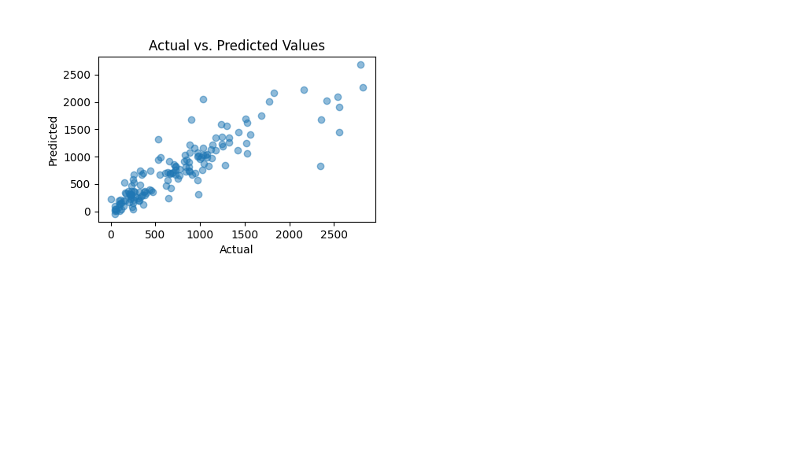
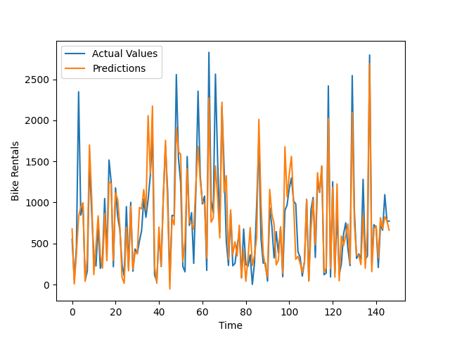
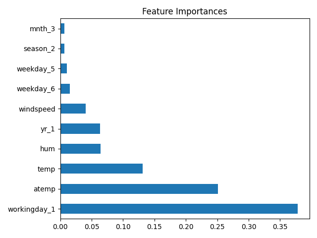

# Finding the best possible model

Data requires to predict the rental demand based on multiple factors like weekday, holiday, temperature, etc.
The code works the data, evaluates multiple popular algorithms like Linear regression, Random forest and Gradient Boosting, after picking the most promising models the code will try to optimize the best hyperparameters of the model, show the results of the model and save the model on the current directory with the current timestamp.

With optimized Gradient Boosting it is possible to achieve a R^2 score of 0.989.

(Graphs generated with matplotlib.)

